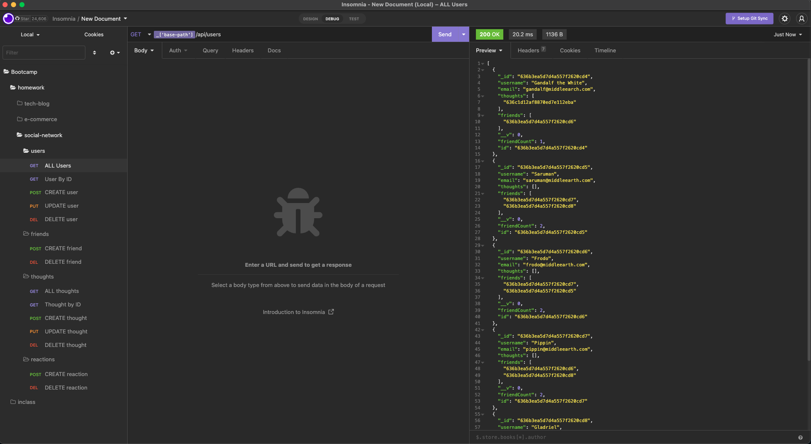

# Social Network

## Description

The social network API application allows users to create an account, add friends, post their thoughts, and share reactions to other user's thoughts. The app uses node express server, MongoDB, and mongoose ODM to manage all the request and database updates. 

## Demo Video and Screenshots

[Walkthrough Demo](https://drive.google.com/file/d/1D9gaDfqLab6hfLKU2Yn2TRtOI_A4bGlK/view?usp=share_link)




## Install

```sh
npm i
```

## Usage

`Seed database`
```sh
npm run seed
```

`Start the app`
```sh
npm start
```

`Run nodemon server`
```sh
npm run watch
```


